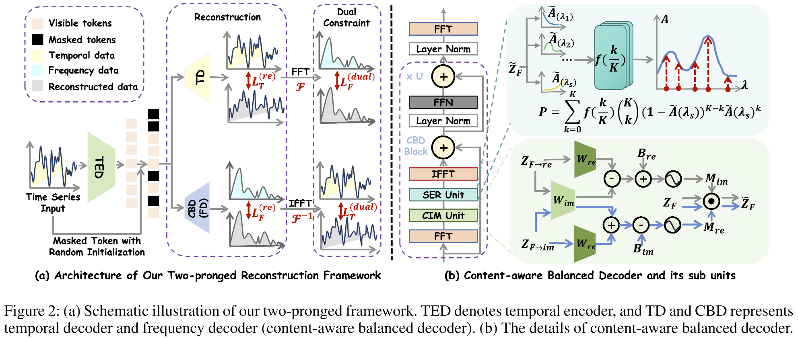

# TSCBD (AAAI25)

This is the codebase for the paper: [Content-Aware Balanced Spectrum Encoding in Masked Modeling for Time Series Classification](https://arxiv.org/abs/2412.13232).

## Introduction



Due to the superior ability of global dependency, transformer and its variants have become the primary choice in Masked Time-series Modeling (MTM) towards time-series classification task. In this paper, we experimentally analyze that existing transformer-based MTM methods encounter with two under-explored issues when dealing with time series data: (1)they encode features by performing long-dependency ensemble averaging, which easily results in rank collapse and feature homogenization as the layer goes deeper; (2) they exhibit distinct priorities in fitting different frequency components contained in the time-series, inevitably leading to spectrum energy imbalance of encoded feature. To tackle these issues, we propose an auxiliary content-aware balanced decoder (CBD) to optimize the encoding quality in the spectrum space within masked modeling scheme. Specifically, the CBD iterates on a series of fundamental blocks, and thanks to two tailored units, each block could progressively refine the masked representation via adjusting the interaction pattern based on local content variations of time-series and learning to recalibrate the energy distribution across different frequency components. Moreover, a dual-constraint loss is devised to enhance the mutual optimization of vanilla decoder and our CBD. Extensive experimental results on ten time series classification datasets show that our method nearly surpasses a bunch of baselines. Meanwhile, a series of explanatory results are showcased to sufficiently demystify the be haviors of our method.

## Get Started

1、Prepare Data.

- UCR dataset can be obtained from [UCR Time Series Classification Archive](https://www.cs.ucr.edu/~eamonn/time_series_data_2018/).
- UEA dataset can be obtained from [Time Series Classification Website](https://www.timeseriesclassification.com/).
- The preprocessed HAR dataset can be obtained from [TS-TCC codebase](https://github.com/emadeldeen24/TS-TCC).

The datasets need to be placed in the dataset folder. 

2、Training.

```shell
python main.py --training_mode self_supervised --selected_dataset selected_dataset
```

Other training configs can be found in `main.py`.

3、Evaluation

Train Linear: 

```shell
python main.py --training_mode train_linear --selected_dataset selected_dataset
```

Fine Tuning:

```shell
python main.py --training_mode finetune --selected_dataset selected_dataset
```

## Citation

If you find this repo useful, please cite our paper.

```
@misc{han2024contentawarebalancedspectrumencoding,
      title={Content-aware Balanced Spectrum Encoding in Masked Modeling for Time Series Classification}, 
      author={Yudong Han and Haocong Wang and Yupeng Hu and Yongshun Gong and Xuemeng Song and Weili Guan},
      year={2024},
      eprint={2412.13232},
      archivePrefix={arXiv},
      primaryClass={cs.LG},
      url={https://arxiv.org/abs/2412.13232}, 
}
```

## Acknowledement

We appreciate the following github repos a lot for their valuable code base or datasets:

- TS-TCC: https://github.com/emadeldeen24/TS-TCC

- SimMTM: https://github.com/thuml/SimMTM?tab=readme-ov-file

- TimeMAE: https://github.com/Mingyue-Cheng/TimeMAE
